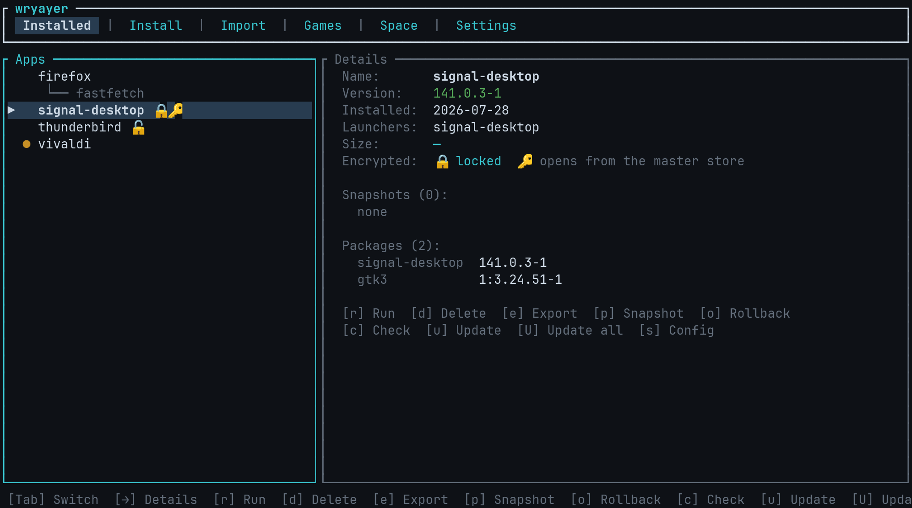
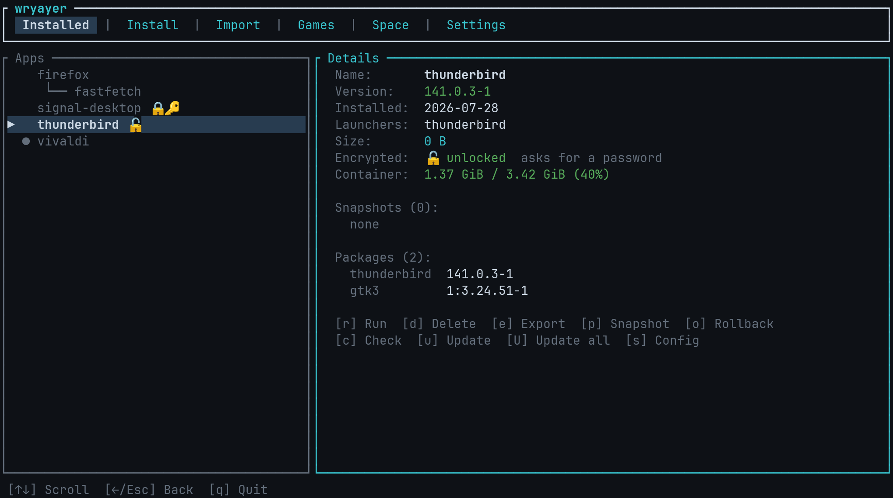
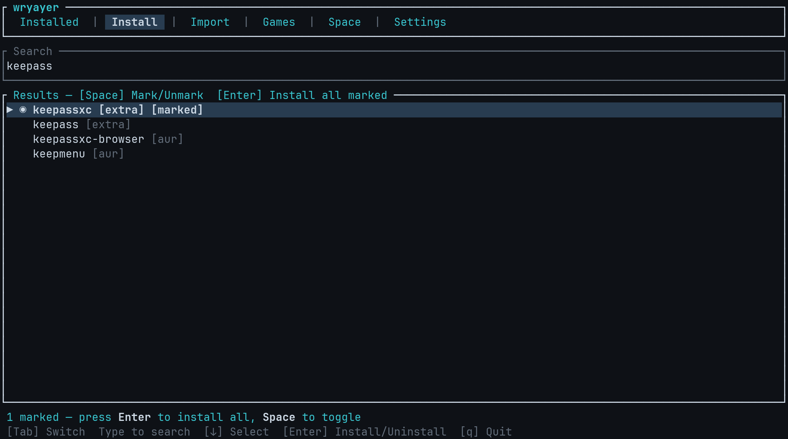
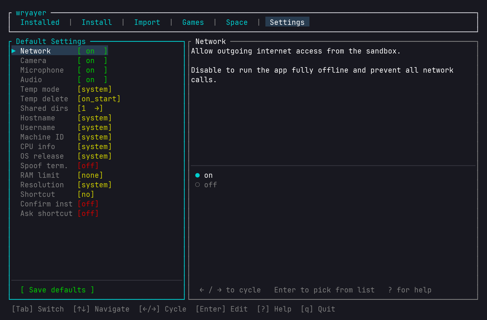
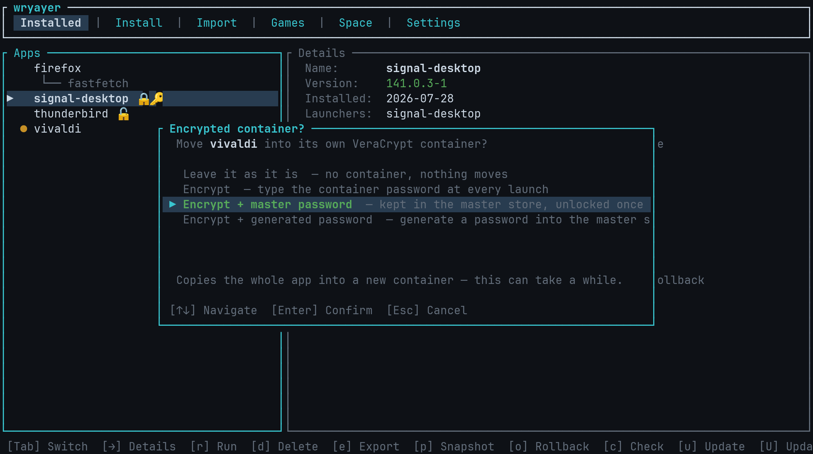
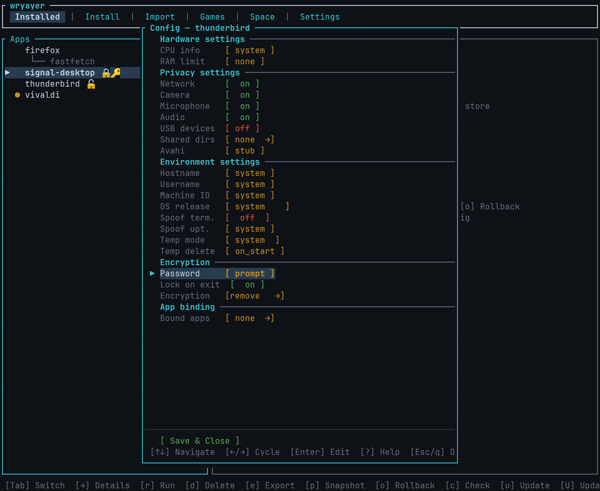

# wryayer

> Isolated per-app package management — no root, no containers, no daemon.
> Supports **Arch Linux** (pacman + AUR), **Debian / Ubuntu** (apt), and **Fedora / RHEL** (dnf/rpm).

[](LICENSE)
[](https://github.com/KsmBl/wryayer)
[](https://rustup.rs)

wryayer installs packages into fully-isolated per-app directory trees under `~/.wryayer/<app>/`. Each app and all its transitive dependencies live in their own private filesystem root and are launched inside a **bubblewrap** (`bwrap`) sandbox. No root access, no systemd units, no Flatpak runtimes — just ordinary files, hard links, and Linux namespaces.

On **Arch Linux** it resolves and downloads packages via `pacman` and the AUR. On **Debian / Ubuntu** it uses `apt-get download` and `dpkg-deb`. On **Fedora / RHEL** and derivatives it uses `dnf download` and `rpm2cpio`. The distro is detected automatically from `/etc/os-release`.

> 🛠 **Curious how it works inside?** The architecture, on-disk layout, sandbox
> internals, and developer/testing docs live in **[`README-CODE.md`](README-CODE.md)**.

---

## Why this exists

Arch Linux has one of the richest package ecosystems on the planet, but its single-root package model means:

- Installing an old or alternate version of an app is painful or impossible without AUR hacks.
- A poorly-packaged AUR tool can clobber shared libraries used by other apps.
- There is no per-app permission model: once installed, an app can read your entire home directory.

wryayer solves all three by extracting packages into self-contained directory trees that are bind-mounted as `/` at runtime. Apps can't see your home directory unless you explicitly share a folder. Conflicting dependency versions coexist without interference. Removing an app is a single `rm -rf`.

**It is not a security sandbox.** The goal is isolation and disk-space efficiency, not hardened confinement. A determined app can still escape via `/proc`, shared IPC, or device access; `audio=off` and `network=off` raise the bar but are not guarantees.

What it *does* protect is data at rest: an app can be installed into its own
[VeraCrypt container](#encrypted-containers), which keeps its entire tree —
filenames included — unreadable while it is locked. That is orthogonal to
runtime confinement, and doesn't make a running app any harder to escape from.

---

## The interactive TUI

`wryayer tui` is the fastest way to browse installed apps, search and install new
ones, tweak sandbox settings, and launch everything — without memorising a single
subcommand.

```fish
wryayer tui
```

**Installed tab** — every app with a live running-instance count and an update
dot next to anything out of date. The right panel shows version, size, the
available update, snapshots, and the full package list — and, while an app is
running, its instance count plus live **RAM usage** (used / limit) for apps that
have a RAM cap set. Merged-in tools (installed with `--into`) appear indented
under their host.



Apps stored in an [encrypted container](#encrypted-containers) carry a padlock —
🔒 locked, 🔓 open — and a 🔑 when their password is in the master store, so a
launch won't stop to ask. The details panel spells both out, and shows how full
the container is.



**Install tab** — search the official repos and the AUR at once (each result
tagged `[repo]` or `[aur]`). Press `Space` to mark several packages, then
`Enter` to install them all in sequence.



**Settings tab** — global defaults inherited by every newly installed app:
network and device toggles, temp mode, identity spoofing, RAM limit, the
install-behaviour switches (**Confirm install** / **Ask shortcut** / **Clean
cache**), the **master password** for [encrypted containers](#encrypted-containers),
and the **TUI theme** (`default`, `amber`, or `matrix` colours) and **layout**
(`default` top tab strip; `sidebar` — a vertical tab bar with double-line
borders and a prompt cursor; or `bottom` — a bottom tab strip with rounded
borders). Theme and layout are independent, so any colour combines with any
layout, applied live. Values are
colour-coded (green = on, red = off, yellow = other), with a live description
and option list on the right.



**Per-app config** — press `s` on any installed app to override the global
defaults for just that app: network/device toggles, temp mode, identity
spoofing, RAM limit, **Avahi mode**, and (for wine games) the exe and prefix.
Changes are saved to that app's own `config.ini`.

A plain app's config also offers to move it into an encrypted container —
encryption is not a decision you are stuck with at install time:


Choosing it asks where the container's password should come from:



Once an app is encrypted, the same section carries its password source, whether
to lock the container when the app exits, and the way back out:



### Key bindings

| Key | Action |
|---|---|
| `Tab` / `Shift+Tab` | Switch tabs (Installed / Install / Import / **Games** / Space / Settings) |
| `↑` / `↓` or `j` / `k` | Navigate lists |
| `r` | Run selected app |
| `d` / `Delete` | Remove selected app (double-confirm) |
| `e` | Export selected app to a zip |
| `p` | Snapshots: take one, roll back to one, or delete one (`o` opens it too) |
| `u` | Update selected app |
| `U` | Update **all** out-of-date apps |
| `c` | Check for updates |
| `s` | Open per-app config |
| `n` | Rename app (set display name) |
| `q` / `Esc` | Quit / close overlay |
| `t` | Toggle debug log during install/remove operations |
| `?` | Show key-bindings reference |
| `Shift+Q` | Force-quit from anywhere |

**Update indicators** — On startup (and after every install/update/remove) wryayer checks all apps for newer versions in the background and marks the out-of-date ones with a dot in the Installed list. `u` updates the selected app; `Shift+U` updates them all after a confirmation listing what's out of date.

**Running-instance count** — Apps with a live sandbox running show a count next to their name, so you can see at a glance what's open.

**Multi-select install** — In the Install tab, press `Space` to mark one or more search results, then `Enter` to install all marked packages one after another. Marks persist across searches, so you can queue packages from several searches before starting. Pressing `Enter` with no marks installs the hovered item.

**Install prompts** — Before an install begins, wryayer asks for a confirmation, then whether to create a `~/bin/<name>` launcher shortcut, and finally whether to install the app into its own [encrypted container](#encrypted-containers). The first two can be turned off in the Settings tab if you'd rather installs start immediately:

| Setting | Effect |
|---|---|
| **Default shortcut** | Whether the shortcut prompt pre-selects "Yes" or "No" |
| **Confirm install** | `off` skips the "Install `<pkg>`?" prompt and starts the install immediately |
| **Ask shortcut** | `off` skips the shortcut prompt and silently applies **Default shortcut** |

The encryption prompt only appears when `veracrypt` is installed, and defaults to
"No". Choosing an encrypt option asks for whatever passwords are still needed —
your sudo password, the container password, the master password — each in a
masked prompt, and each **checked as you enter it**. The install itself then runs
in the normal operation window with its live log (`t` to expand), exactly like an
unencrypted install.

Because the passwords are validated up front, a typo costs a re-prompt rather
than a completed multi-gigabyte install that then fails to encrypt. Prompts you
have already satisfied are skipped, so a second encrypted install in the same
session usually asks for nothing at all.

Settings are stored in `~/.wryayer/defaults.ini` and apply as defaults to every newly installed app; per-app overrides always take precedence.

---

## The desktop GUI

For a pointer-driven front-end there is a native **GTK4** GUI (plain GTK — ordinary
buttons and a tab strip, built like the TUI) that does everything the TUI does —
browse, install, run, update, configure, snapshot, export, import, and the
Windows-game wizard — plus a search-and-tick install flow. The tabs mirror the TUI:
**Installed · Install · Import · Games · Space · Settings**.

```
wryayer gui
```

- **Multi-select install** — search the official repos and the AUR, then **tick a
  checkbox** on every package you want and install them all in one go (no per-item
  key presses). You can also type an exact package name to add it directly.
- **Per-app settings** — a proper preferences page with switches, drop-downs and a
  folder picker for shared directories; writes the same `~/.wryayer/<app>/config.ini`
  the CLI uses.
- **Live console** — installs, updates and removals stream their output into a page
  you can close when done.
- **Encryption** — the same markers as the TUI in the app list (🔒 / 🔓 / 🔑), the
  container's fill level in the details panel, and buttons in an app's settings to
  encrypt it, lock, unlock, grow or decrypt it. The Settings tab manages the master
  password store: set or change it, reveal stored passwords, forget this boot's key,
  or delete the store. Passwords are collected in one dialog before the operation
  starts — with only the fields still needed, so an authenticated sudo and an
  unlocked store mean no prompt at all.

The GUI is an **opt-in build feature** so the plain CLI/TUI doesn't require the GTK
development libraries:

```
cargo build --release --features gui
```

It needs `gtk4` (≥ 4.10) at build and run time. On Arch: `sudo pacman -S --needed gtk4`.

---

## Supported distributions

| Distribution | Support | Notes |
|---|---|---|
| **Arch Linux** | ✅ Fully supported | pacman + AUR backend; actively tested |
| **CachyOS** | ✅ Fully supported | Arch-based; primary test environment |
| **Manjaro** | ✅ Fully supported | Arch-based; detected via `ID_LIKE=manjaro` |
| **EndeavourOS / Garuda / other Arch derivatives** | ✅ Fully supported | Detected via `ID_LIKE=arch` or presence of `/usr/bin/pacman` |
| **Debian 12 / 13** | ✅ Fully supported | apt + dpkg backend; actively tested |
| **Ubuntu 22.04 / 24.04** | ✅ Expected to work | Detected via `ID_LIKE=ubuntu`; same apt/dpkg toolchain as Debian — not separately tested |
| **Linux Mint** | ✅ Expected to work | Ubuntu-based; detected via `ID_LIKE=ubuntu`; not separately tested |
| **Fedora 38+** | ✅ Fully supported | dnf + rpm2cpio backend; actively tested |
| **RHEL / AlmaLinux / Rocky** | ✅ Expected to work | Same dnf/rpm backend as Fedora; detected via `ID_LIKE=rhel` |
| **Void Linux** | ❌ Not supported | Uses xbps — no supported backend |
| **openSUSE** | ❌ Not supported | Uses zypper — no supported backend |

Distro detection reads `/etc/os-release`. Distributions not listed above may work if they are closely derived from Arch, Debian, or Fedora and carry a matching `ID_LIKE` value, but are untested.

---

## Prerequisites

wryayer auto-detects your distro from `/etc/os-release` and uses the appropriate package backend. Install the tools for your distro before building.

### Arch Linux

| Requirement | How to install | Notes |
|---|---|---|
| **bubblewrap** | `sudo pacman -S bubblewrap` | Required at runtime |
| **Rust toolchain** | `curl https://sh.rustup.rs -sSf \| sh` | For building |
| **git** | `sudo pacman -S git` | AUR package builds |
| **base-devel** | `sudo pacman -S base-devel` | AUR builds (`makepkg`) |
| **yay** (optional) | AUR | Cache reused when present; fallback is `makepkg` |
| `vercmp` | Bundled with `pacman` | Version comparison |
| `ldconfig` | Bundled with `glibc` | Library cache rebuild after install |
| `glib-compile-schemas` | `sudo pacman -S glib2` | Optional — GLib apps only |
| `update-mime-database` | `sudo pacman -S shared-mime-info` | Optional — needed for GTK MIME detection (color pickers, etc.) |
| `gtk-update-icon-cache` | `sudo pacman -S gtk-update-icon-cache` | Optional — needed for icon themes (Adwaita, hicolor) |
| `gdk-pixbuf-query-loaders` | `sudo pacman -S gdk-pixbuf2` | Optional — pixbuf loader cache |
| `xdg-dbus-proxy` | `sudo pacman -S xdg-dbus-proxy` | Optional — required for the file-picker portal filter (on by default) |
| `dbus-daemon` | Bundled with `dbus` | Optional — runs the private per-sandbox Avahi stub bus (`avahi = stub`, the default) that silences zeroconf errors in Electron/KDE apps without touching the host |
| `veracrypt` | `sudo pacman -S veracrypt` | Optional — required only to install apps into [encrypted containers](#encrypted-containers) |

### Debian / Ubuntu

| Requirement | How to install | Notes |
|---|---|---|
| **bubblewrap** | `sudo apt install bubblewrap` | Required at runtime |
| **Rust toolchain** | `curl https://sh.rustup.rs -sSf \| sh` | For building |
| **binutils** | `sudo apt install binutils` | Provides `readelf` — used by soname scanner |
| **dpkg** | Pre-installed | Package extraction (`dpkg-deb`) |
| **apt** | Pre-installed | Dep resolution and download |
| `ldconfig` | `sudo apt install libc-bin` | Library cache rebuild after install |
| `xdg-dbus-proxy` | `sudo apt install xdg-dbus-proxy` | Optional — required for the file-picker portal filter (on by default) |

> **AUR packages are Arch-only.** On Debian/Ubuntu, only packages from `apt` repos are available. Attempting to install an AUR-only package will print a warning and skip that dep.

### Fedora / RHEL

| Requirement | How to install | Notes |
|---|---|---|
| **bubblewrap** | `sudo dnf install bubblewrap` | Required at runtime |
| **Rust toolchain** | `curl https://sh.rustup.rs -sSf \| sh` | For building |
| **binutils** | `sudo dnf install binutils` | Provides `readelf` — used by soname scanner |
| **dnf** | Pre-installed | Dep resolution and download |
| **rpm2cpio** | `sudo dnf install rpm` | Package extraction |
| `ldconfig` | Pre-installed | Library cache rebuild after install |
| `xdg-dbus-proxy` | `sudo dnf install xdg-dbus-proxy` | Optional — required for the file-picker portal filter (on by default) |

---

## Building from source

```fish
# Clone
git clone https://github.com/KsmBl/wryayer.git
cd wryayer

# Build release binary
cargo build --release

# Install to ~/bin/ (already on PATH if you followed setup)
cp target/release/wryayer ~/bin/
```

For development builds (faster compile, debug symbols):

```fish
cargo build
cp target/debug/wryayer ~/bin/
```

Hacking on wryayer? See [`README-CODE.md`](README-CODE.md) for the architecture
and internals, and [`README-PROGRAMMING.md`](README-PROGRAMMING.md) for a
task-oriented guide to changing the code.

---

## Shell completions

Generate and install completions once; they are auto-loaded by fish:

```fish
# fish
wryayer completions fish > ~/.config/fish/completions/wryayer.fish

# bash
wryayer completions bash >> ~/.bashrc

# zsh
wryayer completions zsh >> ~/.zshrc
```

Re-run after updating the binary to pick up new subcommands.

---

## Usage

### Install an app

```fish
# From the official repos or AUR — wryayer detects automatically
wryayer install firefox
wryayer install neovim

# Override the app directory name and/or the ~/bin/ launcher name
wryayer install python --app-name py312 --bin-name python3.12

# Multiple launchers from one package (e.g. a toolkit shipping several CLIs)
wryayer install imagemagick --bin-names convert,identify,mogrify

# Install straight into its own encrypted container (see Encrypted containers)
wryayer install signal-desktop --encrypt

# Install additively into an existing app's directory — useful for plugins
# and multi-tool bundles. The new package's files land in the target's
# tree (sharing deps already extracted there), but the new package gets
# its own thin manifest dir at ~/.wryayer/<pkg>/ that carries an
# `alias_of` pointer back to the target. Each alias is a first-class
# entry in `wryayer list` and `wryayer tui`, gets its own ~/bin/<name>
# launcher, and can have its own sandbox config.
wryayer install neovim
wryayer install ripgrep --into neovim
wryayer install fd      --into neovim

# Pick a different name for the alias dir (defaults to the package name)
wryayer install hyfetch --into fastfetch --app-name hf

# Some packages install their binary under a name that differs from the
# package name (e.g. vivaldi installs as vivaldi-stable, google-chrome as
# google-chrome-stable). If the install fails with "binary not found", the
# error lists what IS in the bin dirs — re-run with --bin-names:
wryayer install vivaldi --bin-names vivaldi-stable
```

The resulting layout:

```
~/.wryayer/
├── neovim/
│   ├── usr/bin/nvim, rg, fd  ← all the real binaries live here
│   └── .manifest.toml         ← lists neovim, ripgrep, fd packages
├── ripgrep/
│   └── .manifest.toml         ← alias_of = "neovim", launchers = [rg]
└── fd/
    └── .manifest.toml         ← alias_of = "neovim", launchers = [fd]
```

Aliases run inside the target's tree but read **their own** `config.ini`, so
you can give a plugin a different sandbox profile (e.g. `network=off`) than
the host app. Removing an alias deletes only the alias dir + its launcher;
the target's tree is left intact. Removing a target while aliases still point
at it is refused with an explicit error listing the blocking aliases.

### Run an app

```fish
# Via the generated launcher (preferred)
firefox

# Via wryayer run
wryayer run firefox
wryayer run firefox -- --new-window        # pass -- to separate wryayer flags from app flags
wryayer run firefox -- ~/Documents/doc.pdf

# Multi-binary apps installed with --bin-names: pick which binary to invoke.
# Must be one of the launchers registered for the app.
wryayer run neovim --bin nvim

# Aliases (installed via --into) are run via their own alias name, not the target.
# After: wryayer install ripgrep --into neovim
wryayer run ripgrep -- --json "TODO" .   # or just: rg --json "TODO" .
```

### List installed apps

```fish
wryayer list
```

Output:

```
name       version      installed            size       launchers
------------------------------------------------------------------------
firefox    130.0.1-1    2026-05-10T14:23:00  847.3 MiB  firefox
vlc        3.0.21-1     2026-05-11T09:01:00  312.7 MiB  vlc
------------------------------------------------------------------------
apparent: 1.1 GiB   on disk: 960 MiB   saves: 200 MiB
```

### Remove an app

```fish
wryayer remove firefox

# Remove an app and all aliases that point at it in one shot
wryayer remove firefox --cascade
```

If the app has any aliases pointing at it (created via `install --into`),
removal is refused until those aliases are removed first — otherwise their
launcher scripts would silently target a missing directory. Use `--cascade`
to remove the target and all its aliases in one command. Removing the
alias itself is always safe and never touches the target tree.

### Update apps

```fish
wryayer update            # check and update all apps
wryayer update firefox    # update one app
wryayer update --check    # report available updates without installing
wryayer update firefox --full   # clean rebuild instead of a delta update
```

Updates are **incremental (delta)**: wryayer re-downloads and re-extracts only
the packages whose version actually changed, and reuses every unchanged package
straight from the live tree via hard links — so bumping one library in a
400-package app touches just that library instead of re-fetching the whole
dependency tree. If a package *disappears* from the dependency set (or you pass
`--full`), wryayer falls back to a clean full rebuild so no stale files linger.

Updates also **preserve your data and snapshots**: the sandbox `home/` (browser
profiles, settings), the per-app `config.ini`, and every saved snapshot survive
the swap, and any programs merged in with `--into` are re-resolved so their
binaries are never lost. In the TUI, wryayer checks for updates on startup and
marks out-of-date apps with a dot; `u` updates the selected app and `Shift+U`
updates every out-of-date app at once.

### Export and import

```fish
# Pack an app's entire directory tree into a portable zip
wryayer export firefox
wryayer export firefox --output /mnt/backup/firefox-2026.zip

# Import a previously-exported zip (re-creates the app as if freshly installed)
wryayer import firefox-2026.zip
```

Exports are **portable across machines and user accounts**. The sandbox home
lives at `home/<username>` (derived from `$HOME` at launch), so a zip exported
as `alice` would otherwise look empty when imported into `bob`'s account.
Import rewrites the single home directory to the importing user's name, so
profiles and settings carry over regardless of who exported it.

The export progress bar in the TUI is real — wryayer pre-counts entries, then emits `PROGRESS n/total` markers during the zip write so the gauge and ETA reflect actual work done.

### Snapshot and rollback

Snapshots are **instant and near-free in disk space** — they create a hard-linked clone of the live app dir under `~/.wryayer/<app>/.snapshots/<timestamp>/`. Rollbacks atomically restore the live tree from a chosen snapshot.

```fish
# Snapshot the current state of an app
wryayer snapshot firefox

# List snapshots for an app, newest first
wryayer snapshots firefox

# Roll back to the most recent snapshot
wryayer rollback firefox

# Roll back to a specific labelled snapshot
wryayer rollback firefox 20260516-141022

# Delete one specific snapshot
wryayer snapshot-delete firefox 20260516-141022

# Prune old snapshots, keeping the N most recent (default: 3)
wryayer snapshot-prune firefox
wryayer snapshot-prune firefox --keep 5
```

In the TUI, press `o` on an installed app to open the **snapshot manager**: a
list of every snapshot where `Enter` rolls back to the highlighted one and `d`
deletes it. The same chooser is available in the GUI. When called without a
label, `wryayer rollback` restores the most recent snapshot.

Snapshots survive updates: a rollback after an update returns you to the
pre-update version. (Extraction always writes a fresh inode, so the snapshot's
hard link keeps pointing at the old content; the dedup pass at the end of every
install re-establishes shared-library hard links.)

Snapshots are excluded from `wryayer list` size totals, `wryayer dedup`, and the export zip.

In the TUI, `p` opens one screen for the whole lifecycle — take a snapshot, roll
back to one, or delete one. Each is listed with the space deleting it would
actually free, which is far less than it appears to contain: a snapshot shares
almost everything with the live app, and only holds the files the app has since
replaced.

### Encrypt an app

Full details in [Encrypted containers](#encrypted-containers); the commands are:

```fish
wryayer encrypt firefox                  # move it into a new container
wryayer encrypt firefox --master --generate

wryayer unlock firefox                   # mount it
wryayer lock firefox                     # unmount it
wryayer encryption                       # what's encrypted, what's unlocked, how full
wryayer grow firefox                     # give a full container more room
wryayer grow firefox --to 16G
wryayer decrypt firefox                  # back to a plain directory

wryayer master init                      # create the master password store
wryayer master show                      # print stored container passwords
wryayer master lock                      # forget it until re-entered
wryayer master reset                     # delete the store and start over
wryayer genpw                            # a password, without storing it
```

### Deduplicate shared files

After installing multiple apps that share libraries, identical files are automatically hard-linked. Run manually at any time:

```fish
wryayer dedup           # silent
wryayer dedup --verbose # print every file linked
```

Apps stored in encrypted containers each sit on their own filesystem, and a hard
link cannot cross one. `dedup` skips those pairs instead of failing on them, and
reports how much space the container boundaries keep duplicated.

### Clean the download cache

`~/.cache/wryayer` holds downloaded packages, AUR build dirs, and resolved
dependency lists — which reveal what you've installed. Wipe it at any time:

```fish
wryayer clean
```

Set `clean_cache = on` (Settings → Clean cache) to do this automatically after
every install, so nothing recording your app set is left outside `~/.wryayer`.

### Scan for missing shared libraries

If an app crashes with a missing `.so` error, this command finds and installs the missing package:

```fish
wryayer repair firefox
```

### Import a Windows game (wine)

Each game becomes its own self-contained container at `~/.wryayer/<name>/` with
a fresh wine install and its own `WINEPREFIX`. Games can't interfere with each
other, removing one is a single `rm -rf`, and the cross-app dedup pass that
runs at the end of every import hard-links identical wine files between
containers so disk usage stays in check.

```fish
# Import a game folder (wine is installed fresh into the new container)
wryayer install-game ~/Games/NFSU2

# Override the auto-detected main .exe
wryayer install-game ~/Games/Skyrim --exe SkyrimSE.exe

# Pick a different name; delete the source after a successful copy
wryayer install-game ~/Games/NFSU2 --app-name nfsu2 --delete-source

# Run it like any other app
nfsu2
# or
wryayer run nfsu2
```

The game folder lands at `~/.wryayer/<name>/games/<name>/` and the
`WINEPREFIX` at `~/.wryayer/<name>/games/<name>/.wineprefix/`. The container's
manifest tracks wine and its deps as regular `[[packages]]` plus a `wine_game`
block that tells `wryayer run` to launch `wine <exe>` instead of a Linux
binary. The TUI's **Games** tab wraps the same flow in a 3-step wizard
(folder picker → .exe picker → name + delete-source confirm).

### Interactive TUI

The full TUI walkthrough, screenshots, and key-binding reference are near the
top of this page — see **[The interactive TUI](#the-interactive-tui)**.

---

## Per-app configuration

```fish
# Show current config
wryayer config firefox

# Change settings
wryayer config firefox network off        # block internet access
wryayer config firefox audio off          # mute audio output + mic
wryayer config bambustudio usb on         # show USB/removable drives in the app
wryayer config firefox tempmode ramdisk   # private in-memory /tmp
wryayer config firefox ramlimit 2048      # limit to 2 GiB RAM
wryayer config firefox ramlimit none      # remove RAM limit

# Shared directories (bind-mounted read-write into the sandbox)
wryayer config firefox share add ~/Documents
wryayer config firefox share add ~/Downloads
wryayer config firefox share remove ~/Documents
wryayer config firefox share list
```

### Config reference

| Setting | Values | Default | Description |
|---|---|---|---|
| `tempmode` | `system` `ramdisk` `local` `uuid` | `system` | How `/tmp` is provided inside the sandbox |
| `tempdelete` | `never` `on_start` `on_close` | `on_start` | When to clean up local temp dirs (only with `tempmode local`) |
| `network` | `on` `off` | `on` | Allow outgoing network access |
| `camera` | `on` `off` | `on` | Allow `/dev/video*` camera access |
| `microphone` | `on` `off` | `on` | Mask ALSA capture devices (see caveat below) |
| `audio` | `on` `off` | `on` | Mask ALSA + PipeWire/PulseAudio sockets |
| `usb` | `on` `off` | `off` | Bind the removable-media roots (`/run/media`, `/media`, `/mnt`) into the sandbox so USB drives — including ones mounted after launch — are visible to the app |
| `share add <path>` | Any existing directory | — | Bind-mount `<path>` read-write inside the sandbox |
| `ramlimit <MiB\|none>` | Integer (MiB) or `none` | `none` | Hard cap on RAM **and** swap combined, enforced via `systemd-run --scope -p MemoryMax=NM -p MemorySwapMax=0` (requires systemd). Both limits are necessary — without `MemorySwapMax=0` the kernel silently offloads pages to swap (including zram), letting the app exceed the cap. |
| `portal_filter` | `on` `off` | `on` | Hide the host desktop portal so in-sandbox file pickers list only your shared directories instead of the whole home tree. Turn `off` if an app needs portal features (screen-share, portal-based file open). |
| `bind_app <name>` | Another installed app | — | Let this app open links/files in `<name>`'s sandbox (see below) |
| `password_source` | `prompt` `master` | `prompt` | Only for apps in a VeraCrypt container: where the container password comes from (see [Encrypted containers](#encrypted-containers)) |
| `lock-on-exit` | `on` `off` | `on` | Unmount an encrypted app's container when the app exits. `off` keeps it mounted until locked by hand — no sudo prompt per launch, but the files stay readable |

## Encrypted containers

An app can live inside its **own VeraCrypt container** instead of a plain
directory. While the container is locked its files are unreadable — not just
their contents but the entire tree: filenames, the package list, the browser
profile, all of it. `~/.wryayer/<app>/` is simply an empty directory until the
container is mounted over it.

This is independent of encrypting `~/.wryayer` as a whole. Encrypting the root
protects everything at once behind one password; a per-app container adds a
second, separate lock so that unlocking your app collection doesn't
automatically expose the one app you care most about.

```fish
# During install (the TUI asks right after the ~/bin shortcut question)
wryayer install signal-desktop --encrypt

# Or convert an already-installed app
wryayer encrypt firefox
wryayer encrypt firefox --master --generate   # generated password, kept in the master store

wryayer unlock firefox      # mount it
wryayer lock firefox        # unmount it
wryayer encryption          # what's encrypted, what's unlocked, and how full
wryayer grow firefox        # rebuild its container with more room
wryayer decrypt firefox     # move it back to a plain directory
```

All of it is reachable from the TUI too: open an app's settings with `s` and
look under **Encryption**. A plain app offers one row that moves it into a
container; an encrypted one shows its password source, lock-on-exit, and the row
that takes it back out. An alias shows neither — its files live in the target
app's tree, so sealing its own directory would protect nothing. Encrypt that app
instead.

The container is a completely ordinary VeraCrypt volume at
`~/.wryayer/.containers/<app>.hc` — you can open it with the VeraCrypt GUI on
any machine. It uses AES-256 with SHA-512 header derivation and an ext4
filesystem (ext4 because app trees need symlinks, exec bits and hard links —
snapshots and `wryayer dedup` are built on hard links).

**Sizing.** The container is created *after* the install finishes, so it is
sized from what the app actually occupies rather than a guess: `used + headroom`,
where headroom is half the tree clamped to 512 MiB…2 GiB, plus ext4 overhead. A
50 MiB utility gets 768 MiB; a 10 GiB game gets 12.5 GiB. Small apps get
generous room to grow because it costs little; large apps get proportionally
less because doubling 10 GiB is expensive.

**Running out of room.** A long-lived app eventually fills its container anyway —
a browser accumulating a profile and a cache is the usual culprit. wryayer tells
you before the app does:

- `wryayer encryption` lists used bytes and fill percentage per container, and
  flags anything at 90% or more.
- The TUI details pane shows the same, green → amber → red.
- `wryayer run` prints a warning at launch if the container is at 90% or more.

```fish
wryayer grow firefox            # re-size the way a fresh container would be
wryayer grow firefox --to 16G   # or pick the size yourself
```

VeraCrypt volumes cannot be resized in place, so growing creates a larger
container, copies the contents across and swaps the files. It is slow for a big
volume, but safe: the original is deleted only once the copy is verified, so an
interruption leaves the app intact. The container must be unlocked, and the whole
new size has to fit on the host filesystem alongside the old one.

### Installing more into an encrypted app

`wryayer install <pkg> --into <encrypted-app>` needs no decision: the files are
written straight into that app's container, so the TUI doesn't ask whether to
encrypt them — there is no second container to create. It unlocks the target
first (asking only for what it doesn't already know) and installs into it.

The container is grown automatically if it would run out of room. VeraCrypt
volumes are fixed-size and cannot be resized in place, so growing means creating
a larger container, copying the contents across and swapping the files — slow,
but it only happens when actually needed, and the original is kept until the
copy is complete. Space is checked again before each package the
soname-repair pass pulls in, because one missing library can drag in a
multi-gigabyte driver long after the install was sized.

### Where the password comes from

Set per app under **Encryption** in the config screen, or with
`wryayer config <app> …`:

| `password_source` | Behaviour |
|---|---|
| `prompt` (default) | You type the container password before every launch. Nothing is stored on disk. |
| `master` | The password is read from the master password store, so launches don't prompt. |

Either way the container is **unmounted when the app exits**, so its files stop
being readable the moment you close it. That costs a sudo prompt per launch;
`wryayer config <app> lock-on-exit off` trades it back for staying mounted until
you `wryayer lock` it.

### The master password store

One file holding one container password per app, encrypted with a single master
password you type **once per boot**:

The TUI has all of this under **Settings tab → Encryption**:

| Row | What it does |
|---|---|
| **Master password** | Create it, or change it (asks for the current one first) |
| **Stored passwords** | Show the container passwords held in the store |
| **Forget master password** | Drop the cached key so it's asked for again |

`wryayer master show` is worth knowing about: a **generated** password is never
printed when it is created, so this is the only way to read one — to put it in a
password manager, or to open the container with the VeraCrypt GUI directly.
Everything is also available on the command line:

```fish
wryayer master init              # create it
wryayer master set firefox       # type a password for an app
wryayer master set firefox --generate
wryayer master list              # which apps have a stored password
wryayer master show              # print every stored password
wryayer master show firefox      # print just this one
wryayer master forget firefox
wryayer master change            # change the master password
wryayer master lock              # require the master password again now
wryayer master reset             # delete the store (see below)
```

**If the store will not open.** `master change` needs the current password and
`master init` refuses while a store exists, so a forgotten or damaged store used
to be a dead end. `wryayer master reset` deletes it and lets you start again. It
refuses while any encrypted app is set to `password_source = master` — the store
holds the only copy of those container passwords, and deleting it makes those
containers permanently unopenable. Print them with `wryayer master show` first,
or pass `--force` if you mean it.

The store is at `~/.wryayer/.passwords.vault`: **Argon2id** stretches the master
password into a 256-bit key, and **AES-256-GCM** encrypts the payload. GCM is
authenticated, so a wrong master password, a corrupted file and a tampered one
all fail loudly instead of yielding garbage.

"Once per boot" works without any daemon: the *derived key* — never the master
password, never the app passwords — is cached in `$XDG_RUNTIME_DIR`, a tmpfs the
kernel discards on reboot. Changing the master password re-salts the store,
which invalidates the cache automatically.

### The password generator

`wryayer genpw` (and the `--generate` flags) builds a password from an entropy
pool that mixes `/dev/urandom`, `/dev/random`, every hardware temperature
sensor, the mouse position, RAM usage, scheduler and interrupt counters, and the
nanosecond clock — all folded together through SHA-512.

```console
$ wryayer genpw
=A4$b84%Ty[-FVog}uFG^OL(_Xe;@[L(
entropy sources: /dev/urandom, /dev/random, 24 temperature sensors, RAM usage, scheduler counters, interrupt counters, clock (ns)
```

Passwords are 32 characters by default, drawn from a 90-character alphabet
(letters, digits and 28 symbols — quotes, backslashes and backticks are left out
because these end up in shell-adjacent places). That's about **207 bits**. Each
password is guaranteed to contain at least one lowercase, uppercase, digit and
symbol, and characters are picked by rejection sampling so none is even slightly
more likely than another.

To be straight about the security model: `/dev/urandom` alone is already
cryptographically secure and nothing else here improves on it. Because the
sources are combined with a hash, the extra ones can only ever *add* to the pool
— they can't weaken it. Their real value is covering the case where the kernel
CSPRNG is broken or unseeded (a freshly imaged VM, a cloned container, a kernel
RNG bug), where sensor noise and cycle-level timing are the only things that
differ between two otherwise identical machines. Mouse position is read from the
compositor where one exposes it (Hyprland, X11/XWayland) and otherwise from raw
pointer deltas; Wayland deliberately offers no way to query the cursor, so on
some sessions it contributes only while the mouse is moving.

The exact construction — sources, the SHA-512 extractor, the counter-mode
keystream and the unbiased character selection — is written up in
[`README-CODE.md`](README-CODE.md#password-generation-entropyrs).

### Caveats

- **Mounting needs root.** VeraCrypt sets up a loop device, so wryayer runs it
  under `sudo`. The first container operation after your sudo timeout expires
  asks for your sudo password; later ones reuse the cached credentials. In the
  TUI this is just the first prompt of the install — nothing drops to a bare
  terminal.
- **Locked apps are read-only to wryayer.** `update`, `repair`, `snapshot`,
  `rollback` and `export` refuse to touch a locked app and tell you to unlock it
  first. `wryayer update` (all apps) skips locked ones rather than failing.
  Locked apps still appear in `list` and the TUI, with a 🔒 badge, and can still
  be removed.
- **With `prompt`, don't lose the password.** It is not stored anywhere. A
  generated password is printed once, at creation.

### Keeping the whole of `~/.wryayer` in a container

Separate from per-app containers, you can put `~/.wryayer` *itself* on an
encrypted volume, so every app is protected at rest at once. wryayer supports
this, with one thing to know about it.

An unmounted mount point is an ordinary empty directory. Before the container is
mounted — right after a reboot, or if mounting fails — `~/.wryayer` looks exactly
like a fresh install. wryayer used to take it at face value and write there:
installs landed *underneath* the mount point, and a prompt announced that no
master password store existed and offered to make one. Mounting the container
then hid that second copy, and the next boot brought it back, so the master
password you knew was rejected by a store you never created.

wryayer now records in `~/.local/state/wryayer/root-is-mounted` that its root has
been seen on a filesystem of its own, and refuses to run while it isn't:

```
error: /home/you/.wryayer is not mounted.
```

Mount the container and carry on. The check costs nothing for anyone whose
`~/.wryayer` is a plain directory — the marker is only ever written for a root
that really is its own filesystem. If you deliberately stop using a container,
clear it once:

```fish
WRYAYER_ALLOW_UNMOUNTED_ROOT=1 wryayer list
```

If you were bitten by this before the fix, there may still be a shadow copy
underneath the mount point. A non-recursive bind mount shows what is hidden
under it, without unmounting anything:

```fish
sudo mount --bind -o ro $HOME /mnt
ls -la /mnt/.wryayer        # anything here is the shadow copy
sudo umount /mnt
```

### Reading the TUI

Encrypted apps carry two markers in the app list:

| Marker | Meaning |
|---|---|
| 🔒 | Encrypted, container currently locked — its files are sealed |
| 🔓 | Encrypted, container currently open |
| 🔑 | Its password is in the master store, so launching won't stop to ask |

The padlock changes every time the app is launched and closed; the key reflects
the `password_source` setting, and is the one that tells you whether pressing
Enter will interrupt you. The details pane on the right says the same in words,
and `?` lists every marker.


### Open links in another app (bound apps)

Sandboxes are isolated, so a chat app has no browser — click a link in a
sandboxed Discord and nothing happens (or its bundled `xdg-open` errors). **Bind
apps** bridges two containers: mark which other installed apps a sandbox may
reach, and wryayer exposes them inside as host-delegated launchers. When the app
runs `firefox <url>` — or calls `xdg-open`, which is routed to your bound browser
automatically — the request is forwarded out and re-launched as
`wryayer run firefox -- <url>` in Firefox's own container.

Set it in the TUI (**Bound apps** row on an app's config → tick the apps to
expose) or the GTK config page. No host-wide default-browser change is made; the
routing exists only for the app you configure. Because browsers are
single-instance, repeated links reuse the running Firefox as new tabs.

### File pickers only show shared directories

With `portal_filter` on (the default), opening a file dialog inside a sandboxed
app shows **only the folders you've shared** (`share add …`) — not your real
home directory. This needs `xdg-dbus-proxy` installed; without it the filter is
skipped and the app falls back to the host portal. Set `portal_filter off` for a
specific app if it relies on portal features that the filter blocks.

### Identity spoofing

Override what the sandbox reports about the host machine. Useful for preventing apps from embedding your real hostname, username, OS identity, or machine fingerprint in logs, telemetry, or profiles.

```fish
# Spoof /etc/hostname and $HOSTNAME
wryayer config firefox spoof-hostname myworkstation
wryayer config firefox spoof-hostname sample   # → "workstation"
wryayer config firefox spoof-hostname system   # disable

# Spoof $USER and $LOGNAME
wryayer config firefox spoof-username sample   # → "user"
wryayer config firefox spoof-username myname

# Spoof /etc/machine-id
wryayer config firefox spoof-machine-id system    # use real ID (default)
wryayer config firefox spoof-machine-id random    # fresh UUID every launch
wryayer config firefox spoof-machine-id sample    # → cafebabe0011223344556677deadbeef
wryayer config firefox spoof-machine-id a1b2c3d4e5f6a1b2c3d4e5f6a1b2c3d4

# Spoof the CPU — presets, a custom file, or the TUI configurator
wryayer config firefox spoof-cpuinfo preset:ryzen-9-7950x # a built-in profile
wryayer config firefox spoof-cpuinfo ~/fakecpu.txt        # your own cpuinfo file
wryayer config firefox spoof-cpuinfo system               # disable

# Spoof /etc/os-release (hide real distro identity from the app)
wryayer config firefox spoof-os ubuntu      # present as Ubuntu 24.04 LTS
wryayer config firefox spoof-os arch        # present as Arch Linux
wryayer config firefox spoof-os windows     # present as Windows 11
wryayer config firefox spoof-os arduinoide  # present as ArduinoIDE
wryayer config firefox spoof-os fedora      # custom: any name works via "input" in TUI
wryayer config firefox spoof-os system      # disable

# Spoof terminal — fix fastfetch showing "bwrap" instead of your real terminal
wryayer config fastfetch spoof-terminal on   # detect kitty/foot/alacritty/… and set TERM_PROGRAM
wryayer config fastfetch spoof-terminal off  # disable (default)

# Spoof system uptime — report a fake "up" time to the sandbox
wryayer config fastfetch spoof-uptime 3d4h   # duration: w/d/h/m/s parts
wryayer config fastfetch spoof-uptime 90m    # or e.g. 90 minutes
wryayer config fastfetch spoof-uptime 604800 # or bare seconds (1 week)
wryayer config fastfetch spoof-uptime system # disable

# Disable any spoofing
wryayer config firefox spoof-hostname system
```

**CPU spoofing goes deeper than the file.** Tools like CPU-X and anything built
on `libcpuid` read the CPU by executing the `CPUID` instruction directly, so a
faked `/proc/cpuinfo` alone doesn't fool them. wryayer also injects a small
`LD_PRELOAD` shim that intercepts `CPUID` (via CPUID-faulting) and reports the
spoofed vendor, brand string and family/model/stepping — so the fake CPU is what
detection libraries see too. Pick from **ten built-in profiles** (`preset:<key>`,
spanning budget → flagship → server across Intel and AMD), or build your own in
the TUI: choose **custom** on the *Spoof CPU info* row to open a field-by-field
**configurator** (vendor, model name, family, model, stepping, cores, threads,
MHz, cache, host/mainboard). Press `?` on any field for help.

**The core and thread count is spoofed too.** Set a 64-core CPU and `htop`,
`CPU-X`, `lscpu`, `nproc` and `sysconf` all report 64 cores / 128 threads — not
your real count. This is done on four fronts at once: the rendered
`/proc/cpuinfo`, the `CPUID` topology leaves, `/proc/stat` (per-core meters), and
a rebuilt `/sys/devices/system/cpu`. In `htop` the **first N meters mirror your
host's real cores** and show their live usage; the rest fill out the spoofed
total. Symmetric CPUs (EPYC, Ryzen, Xeon) report exact counts; hybrid Intel
parts (P+E cores) are approximated. Runtimes that read CPU count via the raw
`sched_getaffinity` syscall instead of libc (e.g. Go) still see the real count.

**The mainboard is spoofed alongside the CPU.** An EPYC on your real consumer
board is a giveaway, so whenever a CPU is spoofed wryayer also overlays the
DMI/SMBIOS identity (`/sys/devices/virtual/dmi/id/*`) that drives `fastfetch`'s
`Host:`, `hostnamectl` and `inxi`. Leave it blank and a believable board is
picked to match the CPU (a Supermicro server board for EPYC/Xeon, an enthusiast
desktop board otherwise); or type your own in the configurator's **Host** field
(e.g. `ASUS ROG STRIX X670E-E GAMING`) — the OEM vendor is inferred from the text.

All settings are editable in the TUI config screen (`s` on an installed app). Each row uses a picker; press `?` on any row or option to see a description of what the setting does.

Text-input fields (custom names, spoof strings, the CPU configurator) support
in-line editing: **←/→** move the caret, **Home/End** jump to the ends, and
**Delete** removes the character under the caret. Every settings list wraps
around — pressing **↓** on the last row jumps to the first, and **↑** on the
first jumps to the last.

Press `?` on the **installed** tab for a full key-bindings reference.

| CLI subcommand | Values | Effect |
|---|---|---|
| `spoof-hostname <value\|sample\|system\|off>` | Any string | Writes `/etc/hostname`, sets `$HOSTNAME` |
| `spoof-username <value\|sample\|system\|off>` | Any string | Sets `$USER` and `$LOGNAME` |
| `spoof-machine-id <system\|random\|sample\|hex\|off>` | See below | Writes `/etc/machine-id` |
| `spoof-cpuinfo <preset:key\|path\|custom\|system\|off>` | Preset, path, or configurator | Binds a fake `/proc/cpuinfo` **and** spoofs `CPUID` for `libcpuid`/CPU-X |
| `spoof-os <ubuntu\|arch\|windows\|arduinoide\|name\|system\|off>` | Preset or any OS name | Writes `/etc/os-release` and `/usr/lib/os-release` |
| `spoof-terminal <on\|off>` | `on` or `off` | Detects real terminal via process tree and sets `TERM_PROGRAM` inside sandbox |
| `spoof-uptime <duration\|seconds\|system\|off>` | `3d4h`, `90m`, `604800`, … | Reports a fake system uptime inside the sandbox |

**Sample values:**

| Setting | Sample value |
|---|---|
| hostname | `workstation` |
| username | `user` |
| machine-id | `cafebabe0011223344556677deadbeef` |
| cpuinfo | Ten built-in `preset:` profiles (Intel + AMD, budget → server), or a custom CPU built in the TUI configurator |
| os-release presets | `ubuntu` → Ubuntu 24.04 LTS · `arch` → Arch Linux · `windows` → Windows 11 · `arduinoide` → ArduinoIDE · any other value used as a custom OS name |

**machine-id modes:**

| Value | Behaviour |
|---|---|
| `system` / `off` | No spoofing — real `/etc/machine-id` is used |
| `random` | Generates a fresh 32-char hex UUID on every launch |
| `sample` | Fixed placeholder `cafebabe0011223344556677deadbeef` |
| 32-char hex | Your own fixed machine-id |

The config is stored as a human-readable INI file at `~/.wryayer/<app>/config.ini`.

---

## Caveats

**AUR is Arch-only.** On Debian/Ubuntu and Fedora/RHEL the AUR code path is never reached; deps are resolved via the native package manager only. Attempting to install an AUR-only package on a non-Arch distro will print a warning and skip that dep.

**glibc version pinning.** glibc is resolved and extracted as a normal dependency. The `ld-linux-x86-64.so.2` loader that executes inside the sandbox is therefore the one from the app's own extracted glibc, not the host's. If the app's packages were built against a glibc version that differs significantly from the host kernel's syscall ABI, it may crash with `version GLIBC_X.XX not found` or `Illegal instruction`.

**Microphone isolation is incomplete.** Setting `microphone=off` masks ALSA capture devices (`/dev/snd/pcmC*D*c`). Apps using PipeWire or PulseAudio can still access the microphone socket in `XDG_RUNTIME_DIR`. To fully block mic access, also set `audio=off`.

**Partial D-Bus session isolation.** With `portal_filter` on, the sandbox's session bus is routed through a filter proxy that hides the host desktop portal (so file pickers stay confined to shared dirs) while still forwarding Notifications, secrets, MPRIS, etc. Other session services remain reachable, and with `portal_filter off` the app talks to the host session bus directly.

**Hard links require same filesystem.** Deduplication only works between apps on the same filesystem. Every encrypted app is its own ext4 volume inside its own container, so an encrypted app never shares files with any other app — even one holding byte-identical libraries. `dedup` detects this and reports the space it cannot reclaim ("… stays duplicated across container boundaries") rather than counting it as a failure. The same applies if you mount `~/.wryayer/<app>/` on a separate partition.

**Downloaded packages are signature-verified before extraction.** Because wryayer fetches packages itself rather than letting the package manager install them, it authenticates each archive before unpacking it into a sandbox root: Arch `.pkg.tar.zst` files are checked against the pacman keyring (`gpg`), Fedora `.rpm` files against the rpm keyring (`rpmkeys`), and Debian `.deb` files rely on apt's authenticated acquire (a package apt reports as unauthenticated is rejected). Verification requires the relevant keyring to be present; set `WRYAYER_SKIP_SIG_VERIFY=1` to bypass it for a private or unsigned repository.

**AUR builds run makepkg as your user.** This is the same trust model as using yay directly. Build scripts execute arbitrary code, and the locally-built package has no repository signature to verify. Only install from AUR packages you trust.

**Wayland socket not isolated.** The Wayland display socket (`$XDG_RUNTIME_DIR/wayland-0`) is accessible inside the sandbox via `/run`. Apps have full Wayland access.

**No SETUID/SETCAP binaries.** bwrap drops most capabilities. Apps that rely on setuid helpers (e.g., some network tools) will fail unless you add the helper to your system installation.

---

## Known issues

- **soname resolution occasionally misses packages.** If `wryayer repair` can't find a `.so`, it usually means the owning package uses an unusual installation path. Workaround: install the package system-wide and copy the `.so` into `~/.wryayer/<app>/usr/lib/`.
- **AUR packages with custom build steps** (non-standard `PKGBUILD` layouts) may produce a `.pkg.tar.zst` that doesn't extract cleanly. Check the build log with `[t]` in the TUI.
- **GLib apps may miss GSettings schemas** if a dependency ships schemas that aren't compiled after extraction. wryayer runs `glib-compile-schemas` on the main app's schema dir, but not on dependency dirs. Workaround: run `glib-compile-schemas ~/.wryayer/<app>/usr/share/glib-2.0/schemas/` manually.
- **The TUI progress bar is indeterminate** during install and update operations because pacman doesn't emit structured progress on stderr. The actual log is one `[t]` keypress away.
- **Disk usage figures in `wryayer list`** are per-app apparent sizes; they don't subtract hard-linked savings. The footer line of `wryayer list` and the Space tab in the TUI both show the combined total with savings noted.

---

## Planned features

- [x] **Multi-binary apps** — install an app that ships more than one launcher binary (`--bin-names a,b,c`)
- [x] **Rollback support** — `wryayer snapshot` + `wryayer rollback` (hard-linked, instant)
- [x] **Install into existing app** — `wryayer install <pkg> --into <existing>` for plugins and bundles; alias gets its own first-class entry under `~/.wryayer/<pkg>/` with `alias_of` pointer
- [x] **TUI install target picker** — choosing Install on a search result now prompts whether to start a new app or merge into an existing one
- [x] **Per-app encryption** — install an app into its own VeraCrypt container, mounted over its normal directory; while locked the whole tree is opaque, filenames included
- [x] **Master password store** — one Argon2id + AES-256-GCM file holding a container password per app, unlocked once per boot (the derived key lives in `$XDG_RUNTIME_DIR`, so a reboot asks again)
- [x] **Lock on exit** — an encrypted app's container is unmounted the moment the app closes, so its files stop being readable (`lock-on-exit off` opts out)
- [x] **Multi-source password generator** — `wryayer genpw` mixes `/dev/urandom`, `/dev/random`, hardware temperature sensors, mouse position, RAM/scheduler/interrupt counters and the nanosecond clock through SHA-512; ~207 bits, unbiased character selection
- [x] **Automatic container growth** — installing into an encrypted app grows its container when it would run out of room, including for packages the soname-repair pass pulls in afterwards
- [x] **Fill warnings** — `wryayer encryption`, the TUI details pane and every launch report how full a container is and warn past 90%; `wryayer grow` enlarges one on demand
- [x] **Encrypt after the fact** — move an installed app into a container, or back out of one, from its TUI settings as well as the command line
- [ ] **Wayland isolation** — bind a private Wayland socket so apps can't impersonate each other
- [x] **D-Bus portal filtering** — file pickers run in-sandbox and only show shared dirs, via an `xdg-dbus-proxy` filter that hides the host portal (`portal_filter`)
- [x] **Package signing verification** — every downloaded package is authenticated before extraction (Arch `.pkg.tar.zst` via the pacman keyring, Fedora `.rpm` via the rpm keyring, Debian `.deb` via apt's signed repo metadata)
- [x] **Delta updates** — an update re-downloads and re-extracts only the packages whose version changed, reusing the rest from the live tree via hard links (`wryayer update --full` forces a clean rebuild)
- [ ] **Export/import via SSH or SFTP** — `wryayer export --remote user@host:/path`
- [x] **TUI package search from AUR** — Install tab searches both official repos and the AUR
- [x] **Identity spoofing** — spoof hostname, username, machine-id, OS release, and the CPU per app (fake `/proc/cpuinfo` **and** `CPUID`, with built-in profiles and a TUI configurator)
- [x] **CPU core/thread spoofing** — a spoofed CPU's core/thread count is reflected in `htop`, CPU-X, `lscpu` and `nproc`, with the first meters mirroring the host's real per-core usage
- [x] **Cross-container app binding** — bound apps open each other's links/files in the target app's own sandbox via a host portal (`bind_app`)
- [x] **Global default settings** — Settings tab in TUI and `~/.wryayer/defaults.ini` set defaults inherited by all new apps
- [x] **Multi-select install** — mark multiple search results with `Space`, install them all sequentially with `Enter`; marks persist across searches
- [x] **Update all** — check every app for updates on TUI start and update the out-of-date ones with `Shift+U`
- [ ] **Per-app env var overrides** — let users set `LANG`, `QT_SCALE_FACTOR`, etc. in `config.ini`
- [ ] **Dependency graph viewer** — TUI screen showing the full package tree for an installed app
- [ ] **Auto-snapshot on update** — capture a snapshot automatically before each update so failures can be undone with one keystroke

---

## Contributing & internals

Architecture, on-disk layout, sandbox construction, and developer/testing docs
(build, `cargo test`, coverage) live in **[`README-CODE.md`](README-CODE.md)**.

---

## License

Copyright © 2026 KsmBl and contributors.

wryayer is free software: you can redistribute it and/or modify it under the terms of the **GNU Lesser General Public License** as published by the Free Software Foundation, either version 3 of the License, or (at your option) any later version.

This program is distributed in the hope that it will be useful, but **WITHOUT ANY WARRANTY**; without even the implied warranty of **MERCHANTABILITY** or **FITNESS FOR A PARTICULAR PURPOSE**. See the [GNU Lesser General Public License](https://www.gnu.org/licenses/lgpl-3.0.html) for more details.

A copy of the license is included in this repository as [`LICENSE`](LICENSE).

> **Note for package distributors:** The LGPL requires that users be able to relink a modified version of the library. Because wryayer is a standalone binary application (not a shared library), this condition is satisfied by making the source code available, which this repository does.
